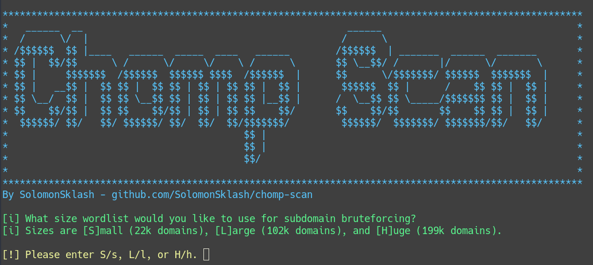
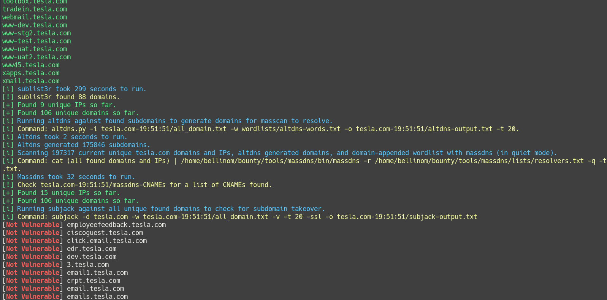
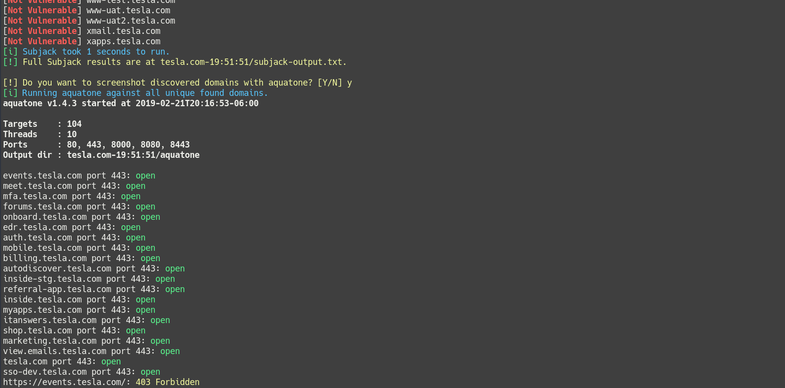
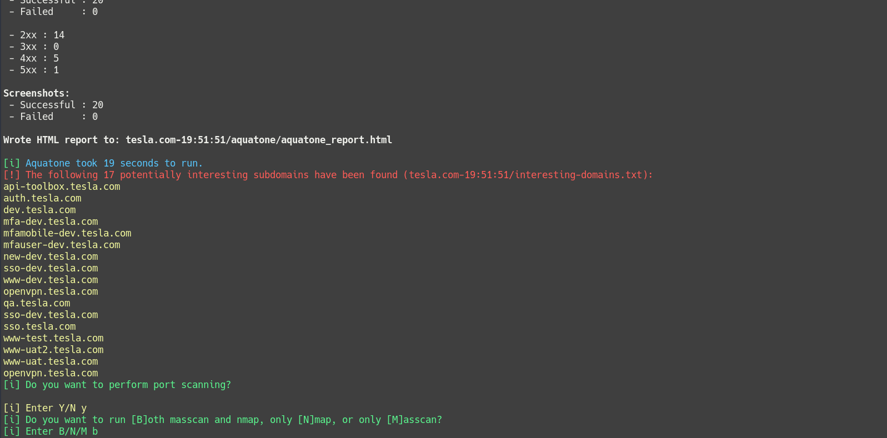
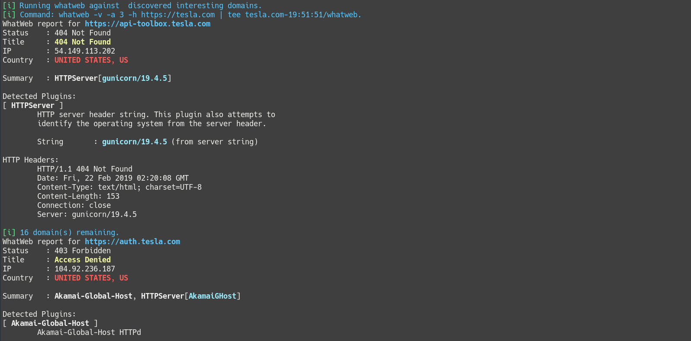
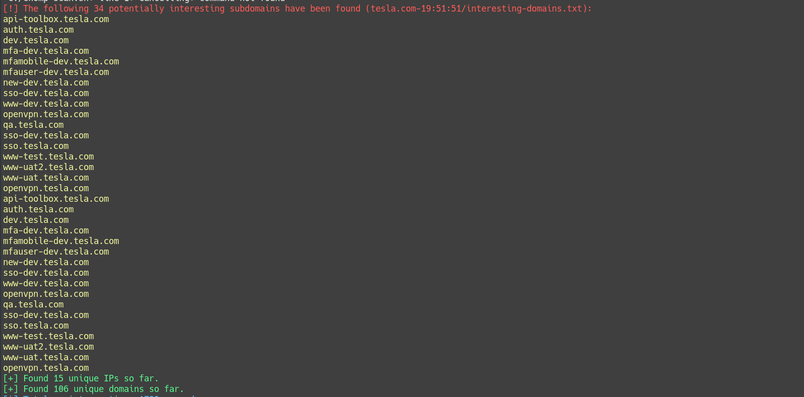

# Chomp Scan


A scripted pipeline of tools to simplify the bug bounty/penetration test reconnaissance phase, so you can focus on chomping bugs.



### Scope
Chomp Scan is a Bash script that chains together the fastest and most effective tools (in my opinion/experience) for doing the long and sometimes tedious process of recon. No more looking for word lists and trying to remember when you started a scan and where the output is. Chomp Scan creates a timestamped output directory based on the search domain, e.g. *example.com-21:38:15*, and puts all tool output there, split into individual sub-directories as appropriate. Custom output directories are also supported via the `-o` flag.

**New**   Chomp Scan now integrates [Notica](https://notica.us), which allows you to receive a notification when the script finishes. Simply visit Notica and get a unique URL parameter, e.g. notica.us/?xxxxxxxx. Pass the parameter to Chomp Scan via the `-n` flag, keep the Notica page open in a browser tab on your computer or phone, and you will receive a message when Chomp Scan has finished running. No more constantly checking/forgetting to check those long running scans.

Chomp Scan runs in multiple modes. The primary one is using command-line arguments to select which scanning phases to use, which wordlists, HTTP or HTTPS,  etc. A guided interactive mode is available, as well as a non-interactive mode, useful if you do not want to deal with setting multiple arguments.

A list of interesting words is included, such as *dev, test, uat, staging,* etc., and domains containing those terms are flagged. This way you can focus on the interesting domains first if you wish. This list can be customized to suit your own needs, or replaced with a different file via the `-X` flag.

A blacklist file is included, to exclude certain domains from the results. However it does not prevent those domains from being resolved, only from being used for port scanning and content discovery. It can be passed via the `-b` flag.

Chomp Scan supports limited canceling/skipping of tools by pressing Ctrl-c. This can sometimes have unintended side effects, so use with care.

**Note: Chomp Scan is in active development, and new/different tools will be added as I come across them. Pull requests and comments welcome!**

### Scanning Phases

#### Subdomain Discovery (3 different sized wordlists)
* [dnscan](https://github.com/rbsec/dnscan)
* [subfinder](https://github.com/subfinder/subfinder)
* [sublist3r](https://github.com/aboul3la/Sublist3r)
* [massdns](https://github.com/blechschmidt/massdns) + [altdns](https://github.com/infosec-au/altdns)

#### Screenshots (optional)
* [aquatone](https://github.com/michenriksen/aquatone)

#### Port Scanning (optional)
* [masscan](https://github.com/robertdavidgraham/masscan) and/or [nmap](https://www.nmap.org)
* nmap output styled with [nmap-bootstrap-xsl](https://github.com/honze-net/nmap-bootstrap-xsl/)

#### Information Gathering (optional) (4 different sized wordlists)
* [subjack](https://github.com/haccer/subjack)
* [bfac](https://github.com/mazen160/bfac)
* [whatweb](https://github.com/urbanadventurer/whatweb/)
* [wafw00f](https://github.com/EnableSecurity/wafw00f)
* [nikto](https://github.com/sullo/nikto)

#### Content Discovery (optional) (4 different sized wordlists)
* [inception](https://github.com/proabiral/inception)
* [waybackurls](https://github.com/tomnomnom/waybackurls)
* [ffuf](https://github.com/ffuf/ffuf)
* [gobuster](https://github.com/OJ/gobuster)
* [dirsearch](https://github.com/maurosoria/dirsearch)

### Configuration File
Chomp Scan now features a configuration file option that provides more granular control over which tools are run and is less cumbersome than passing a large number of CLI arguments. It can be used by passing the `-L` flag. An [example config](https://github.com/SolomonSklash/chomp-scan/blob/master/config) file is included in this repo as a template.

### Wordlists

A variety of wordlists are used, both for subdomain bruteforcing and content discovery. Daniel Miessler's [Seclists](https://github.com/danielmiessler/SecLists) are used heavily, as well as Jason Haddix's [lists](https://gist.github.com/jhaddix). Different wordlists can be used by passing in a custom wordlist or using one of the built-in named argument lists below.

#### Subdomain Bruteforcing
| Argument Name | Filename | Word Count | Description |
| ------ | ------ | ------ | ------ |
| short | subdomains-top1mil-20000.txt | 22k | From Seclists |
| long | sortedcombined-knock-dnsrecon-fierce-reconng.txt | 102k | From Seclists |
| huge | huge-200k.txt | 199k | Combination I made of various wordlists, including Seclists |

#### Content Discovery
| Argument Name | Filename | Word Count | Description |
| ------ | ------ | ------ | ------ |
| small | big.txt | 20k | From Seclists |
| medium | raft-large-combined.txt | 167k | Combination of the raft wordlists in Seclists |
| large | seclists-combined.txt | 215k | Larger combination of all the Discovery/DNS lists in Seclists |
| xl | haddix_content_discovery_all.txt | 373k | Jason Haddix's all content discovery list |
| xxl | haddix-seclists-combined.txt | 486k | Combination of the two previous lists |

#### Misc.
* altdns-words.txt - 240 words - Used for creating domain permutations for [masscan](https://github.com/robertdavidgraham/masscan) to resolve. Borrowed from [altdns](https://github.com/infosec-au/altdns/blob/master/words.txt).
* interesting.txt - 43 words - A list I created of potentially interesting words appearing in domain names. Provide your own interesting words list with the `-X` flag.

### Installation
Clone this repo and run the installer.sh script. Make sure to run `source ~/.profile` in your terminal after running the installer in order to add the Go binary path to your $PATH variable. Then run Chomp Scan.

### Usage
Chomp Scan always runs subdomain enumeration, thus a domain is required via the `-u` flag. The domain should not contain a scheme, e.g. http:// or https://. By default, HTTPS is always used. This can be changed to HTTP by passing the `-H` flag. A wordlist is optional, and if one is not provided the built-in short list (20k words) is used.

Other scan phases are optional. Content discovery can take an optional wordlist, otherwise it defaults to the built-in short (22k words) list.

The final results of the scan are stored in three text files in the output directory. All unique domains that are found, whether they resolve or not, are stored in `all_discovered_domains.txt`, and all unique IPs that are discovered are stored in `all_discovered_ips.txt`. All domains that resolve to an IP are stored in `all_resolved_domains.txt`. As of v4.1 these domains are used to generate the interesting domain list and the all domains list, which can then be used for content discovery and information gathering.
```
chomp-scan.sh -u example.com -a d short -cC large -p -o path/to/directory

Usage of Chomp Scan:
        -u domain
                 (required) Domain name to scan. This should not include a scheme, e.g. https:// or http://.
        -d wordlist
                 (optional) The wordlist to use for subdomain enumeration. Three built-in lists, short, long, and huge can be used, as well as the path to a custom wordlist. The default is short.
        -c
                 (optional) Enable content discovery phase. The wordlist for this option defaults to short if not provided.
        -C wordlist
                 (optional) The wordlist to use for content discovery. Five built-in lists, small, medium, large, xl, and xxl can be used, as well as the path to a custom wordlist. The default is small.
        -s
                 (optional) Enable screenshots using Aquatone.
        -i
                 (optional) Enable information gathering phase, using subjack, bfac, whatweb, wafw00f, and nikto.
        -p
                 (optional) Enable portscanning phase, using masscan (run as root) and nmap.
        -I
                 (optional) Enable interactive mode. This allows you to select certain tool options and inputs interactively. This cannot be run with -D.
        -D
                 (optional) Enable default non-interactive mode. This mode uses pre-selected defaults and requires no user interaction or options. This cannot be run with -I.
                            Options: Subdomain enumeration wordlist: short.
                                     Content discovery wordlist: small.
                                     Aquatone screenshots: yes.
                                     Portscanning: yes.
                                     Information gathering: yes.
                                     Domains to scan: all unique discovered.
        -b wordlist
                 (optional) Set custom domain blacklist file.
        -X wordlist
                 (optional) Set custom interesting word list.
        -o directory
                 (optional) Set custom output directory. It must exist and be writable.
        -a
                 (optional) Use all unique discovered domains for scans, rather than interesting domains. This cannot be used with -A.
        -A
                 (optional, default) Use only interesting discovered domains for scans, rather than all discovered domains. This cannot be used with -a.
		-H
                 (optional) Use HTTP for connecting to sites instead of HTTPS.
        -h
                 (optional) Display this help page.
```

### In The Future

Chomp Scan is still in active development, as I use it myself for bug hunting, so I intend to continue adding new features and tools as I come across them. New tool suggestions, feedback, and pull requests are all welcomed. Here is a short list of potential additions I'm considering:

* Adding a config file, for more granular customization of tools and parameters
* The generation of an HTML report, similar to what aquatone provides

### Examples







## Thanks
Thanks to all the authors of the included tools. They do all the heavy lifting.
